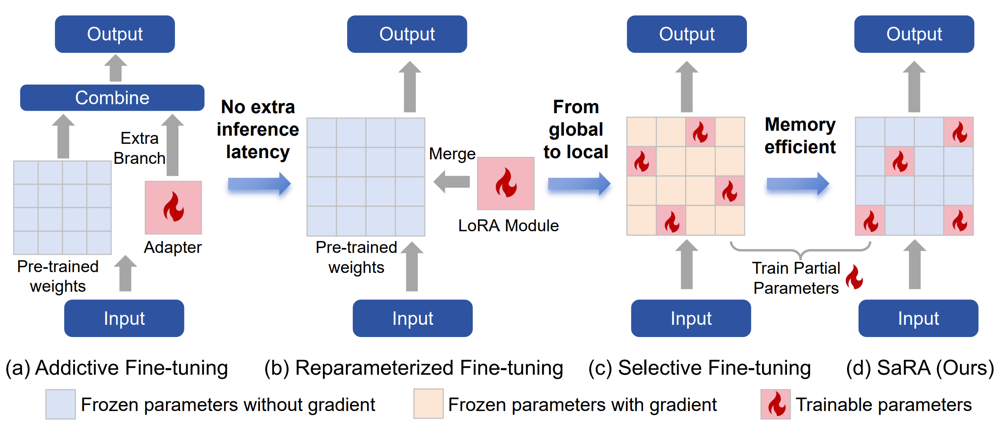

# SaRA: High-Efficient Diffusion Model Fine-tuning with Progressive Sparse Low-Rank Adaptation
###  [Paper](https://export.arxiv.org/pdf/2409.06633) | [Project Page](https://sjtuplayer.github.io/projects/SaRA/)
<!-- <br> -->
[Teng Hu](https://github.com/sjtuplayer), 
[Jiangning Zhang](https://zhangzjn.github.io/),
[Ran Yi](https://yiranran.github.io/),
[Hongrui Huang](https://github.com/sjtuplayer/MotionMaster),
[Yabiao Wang](https://scholar.google.com/citations?hl=zh-CN&user=xiK4nFUAAAAJ),
 and [Lizhuang Ma](https://dmcv.sjtu.edu.cn/) 
<!-- <br> -->

<p align="center">

</p>

### 🛠️ Installation

- **Env**: We have tested on `Python 3.9.5` and `CUDA 11.8` (other versions may also be fine).
- **Dependencies**: `pip install -r requirements.txt`


### 🚀 Quick Start

#### 🚀 Run SaRA by modifying a single line of code 

you can easily employ SaRA to finetune the pre-trained model by modifying a single line of code:

```
from optim import adamw
model = Initialize_model()
optimizer = adamw(model,threshold=2e-3)   # modify this line only
for data in dataloader:
    model.train()
model.save()
```

#### 🚀 Save and load only the trainable parameters
If you want to save only the trainable parameters, you can use ```optimizer.save_params()```, which can save only the fien-tuned parameters (e.g, 5M, 10M parameters).
```
optimizer = adamw(model,threshold=2e-3)
optimizer.load($path_to_save)
torch.save(optimizer.save_params(),$path_to_save)
```

### 🍺 Examples


#### 📖 Datasets

For the downstream dataset fine-tuning task, we employ five dataset, including BarbieCore, CyberPunk, ElementFire, Expedition, and Hornify ([Google Drive](https://drive.google.com/file/d/1iaUUBX8TnvBLMenUMyxMya8O0Oa4BlU4/view?usp=drive_link)).
Each dataset is structured as:
```
dataset_name
   ├── name1.png
   ├── name2.png
   ├── ...
   ├── metadata.jsonl
```
where ```metadata.jsonl``` contains the prompts (captioned by BLIP) for each image. 


#### 🚀Fine-tuning on downstream dataset
Put the downloaded datasets in ```Example/dataset```, and then run:

```
cd Examples
python3 finetune.py \
   --config=configs/Barbie.json \
   --output_dir=$path_to_save \
   --sd_version=1.5 \
   --threshold=2e-3 \
   --lr_scheduler=cosine \
   --progresive_iter=2500 \
   --lambda_rank=0.0005\
```

#### 🚀Fine-tuning Dreambooth

Coming Soon

#### 🚀Fine-tuning Animatediff

Coming Soon


